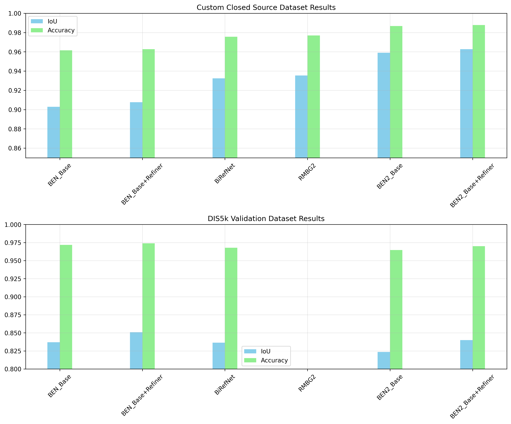
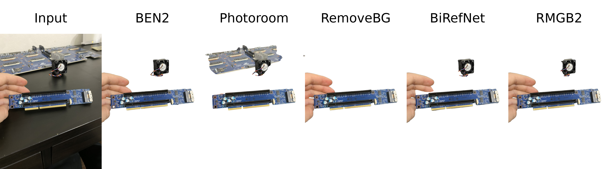
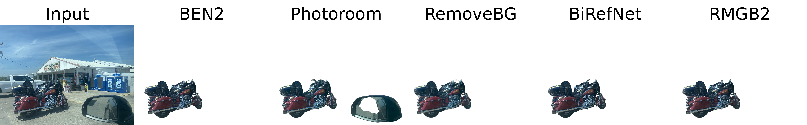
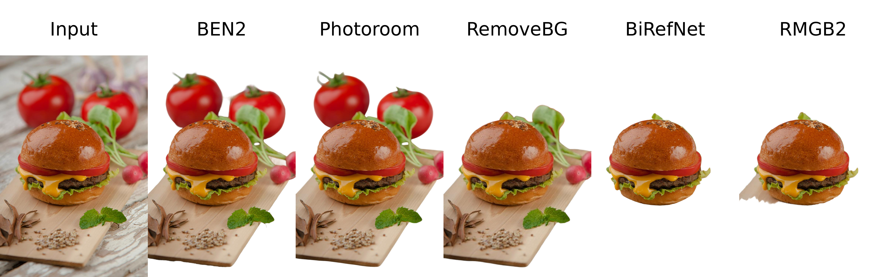

# BEN2: Background Erase Network

[](https://arxiv.org/abs/2501.06230)
[](https://huggingface.co/PramaLLC/BEN2)
[](https://backgrounderase.net)

## Overview
BEN2 (Background Erase Network) introduces a novel approach to foreground segmentation through its innovative Confidence Guided Matting (CGM) pipeline. The architecture employs a refiner network that targets and processes pixels where the base model exhibits lower confidence levels, resulting in more precise and reliable matting results. This model is built on BEN:
[](https://paperswithcode.com/sota/dichotomous-image-segmentation-on-dis-vd?p=ben-using-confidence-guided-matting-for)


## BEN2 access
BEN2 was trained on the DIS5k and our 22K proprietary segmentation dataset. Our enhanced model delivers superior performance in hair matting, 4K processing, object segmentation, and edge refinement. Our Base model is open source. To try the full model through our free web demo or integrate BEN2 into your project with our API:
- 🌐 [backgrounderase.net](https://backgrounderase.net)


## Contact us
- For access to our commercial model email us at sales@prama.llc
- Our website: https://prama.llc/
- Follow us on X: https://x.com/PramaResearch/

## Download weights
You can find the weights to BEN2 base from our Huggingface: https://huggingface.co/PramaLLC/BEN2


## Using ben2

```
pip install git+https://github.com/PramaLLC/BEN2.git
```
```python
import torch
from ben2 import AutoModel
from PIL import Image

device = torch.device('cuda' if torch.cuda.is_available() else 'cpu')


image = Image.open("image.jpg") # your image here 
model = AutoModel.from_pretrained("PramaLLC/BEN2") # repo_id
model.to(device).eval()
foreground = model.inference(image)

foreground.save("foreground.png")

```

## Quick start code (inside cloned repo)

```python
import BEN2
from PIL import Image
import torch


device = torch.device('cuda' if torch.cuda.is_available() else 'cpu')

file = "./image.png" # input image

model = BEN2.BEN_Base().to(device).eval() #init pipeline

model.loadcheckpoints("./BEN2_Base.pth")
image = Image.open(file)
foreground = model.inference(image, refine_foreground=False,) #Refine foreground is an extract postprocessing step that increases inference time but can improve matting edges. The default value is False.

foreground.save("./foreground.png")

```


## Batch image processing

```python
import BEN2
from PIL import Image
import torch


device = torch.device('cuda' if torch.cuda.is_available() else 'cpu')


model = BEN2.BEN_Base().to(device).eval() #init pipeline

model.loadcheckpoints("./BEN2_Base.pth")

file1 = "./image1.png" # input image1
file2 = "./image2.png" # input image2
image1 = Image.open(file1)
image2 = Image.open(file2)


foregrounds = model.inference([image1, image2]) #  We recommended that batch size not exceed 3 for consumer GPUs as there are minimal inference gains. Due to our custom batch processing for the MVANet decoding steps.
foregrounds[0].save("./foreground1.png")
foregrounds[1].save("./foreground2.png")

```


## BEN2 video segmentation
[](https://www.youtube.com/watch?v=skEXiIHQcys)

## Video Segmentation

```bash
sudo apt update
sudo apt install ffmpeg
```

```python
import BEN2
from PIL import Image
import torch


device = torch.device('cuda' if torch.cuda.is_available() else 'cpu')

video_path = "/path_to_your_video.mp4"# input video

model = BEN2.BEN_Base().to(device).eval() #init pipeline

model.loadcheckpoints("./BEN2_Base.pth")


model.segment_video(
    video_path= video_path,
    output_path="./", # Outputs will be saved as foreground.webm or foreground.mp4. The default value is "./"
    fps=0, # If this is set to 0 CV2 will detect the fps in the original video. The default value is 0.
    refine_foreground=False,  #refine foreground is an extract postprocessing step that increases inference time but can improve matting edges. The default value is False.
    batch=1,  # We recommended that batch size not exceed 3 for consumer GPUs as there are minimal inference gains. The default value is 1.
    print_frames_processed=True,  #Informs you what frame is being processed. The default value is True.
    webm = False, # This will output an alpha layer video but this defaults to mp4 when webm is false. The default value is False.
    rgb_value= (0, 255, 0) # If you do not use webm this will be the RGB value of the resulting background only when webm is False. The default value is a green background (0,255,0).
 )


```

## ONNX support 
You can find the ONNX weights to BEN2 base from our [Huggingface](https://huggingface.co/PramaLLC/BEN2/blob/main/BEN2_Base.onnx) and the inference code [here](https://huggingface.co/PramaLLC/BEN2/blob/main/onnx_run.py).


## BEN2 evaluation


RMBG 2.0 did not preserve the DIS 5k validation dataset







## Installation
1. Clone Repo
2. Install requirements.txt
